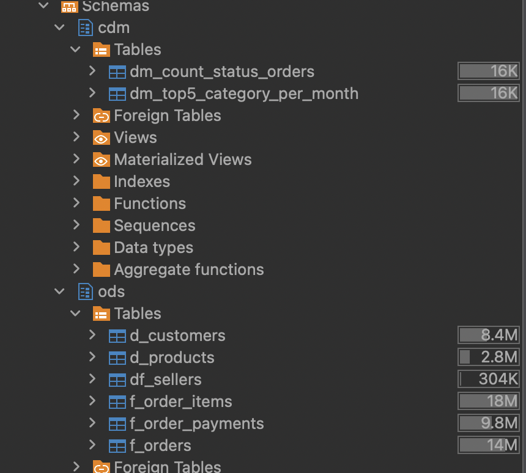
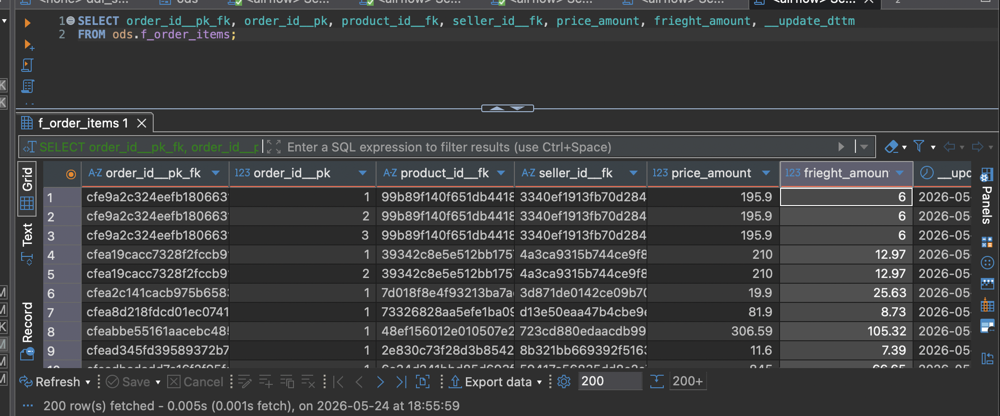

# Краткое содержание проекта

ETL-пайплайн данных для Ecommerce.
Исходные данные были взяты из Kaggle.
Пайплайн поочередно обрабатывает данные и складывает в 3 слоя (Staging,ODS,CDM), находящиеся в S3

## Стек:
* **Хранение данные** - S3 (MinIO) | db (postgreSQL)
* **Обработка данных** - PySpark
* **Оркестрация данных** - Airflow
* **Тестирование и валидация кода** - Jupyter Notebook

# Результат
Получены сырые и готовые данные, которые хранятся как в Data Lake (S3), так и в PostgreSQL:

* В **Staging** хранится raw data, сохранненную через API.
* В **ODS** хранятся очищенные данные в формате **Snowflake Scheme** - 3 таблицы фактов f_orders, f_order_items и f_order_payments, а также 3 справочника - d_customers, d_products и d_sellers. На основе полученных таблиц, можно строить будущую Аналитическую BI-отчетность.
* В **CDM** хранятся готовые витрины данных для бизнеса dm_count_status_orders (подсчет заказов по статусам на сегодняшний день) и dm_top5_category_per_month (подсчет топ-5 самых популярных категорий продуктов товаров в разрезе год-месяц).

# Структура папок
* **spark-jobs** хранит джобы, которые собирают витрины данных
* **dags** содержит процессы оркестрации airflow

# Скриншоты проекта

# Контакты
tg - whoisortem

