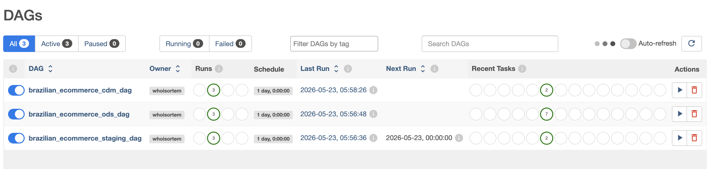
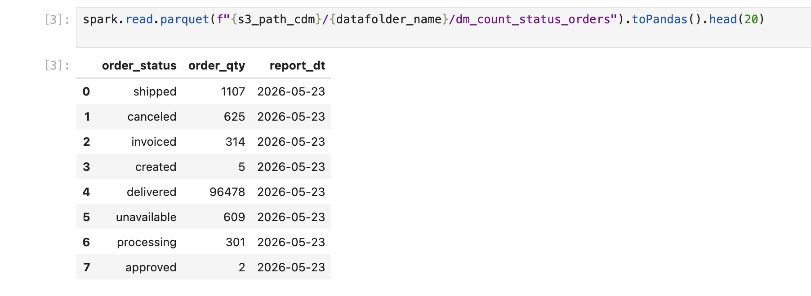
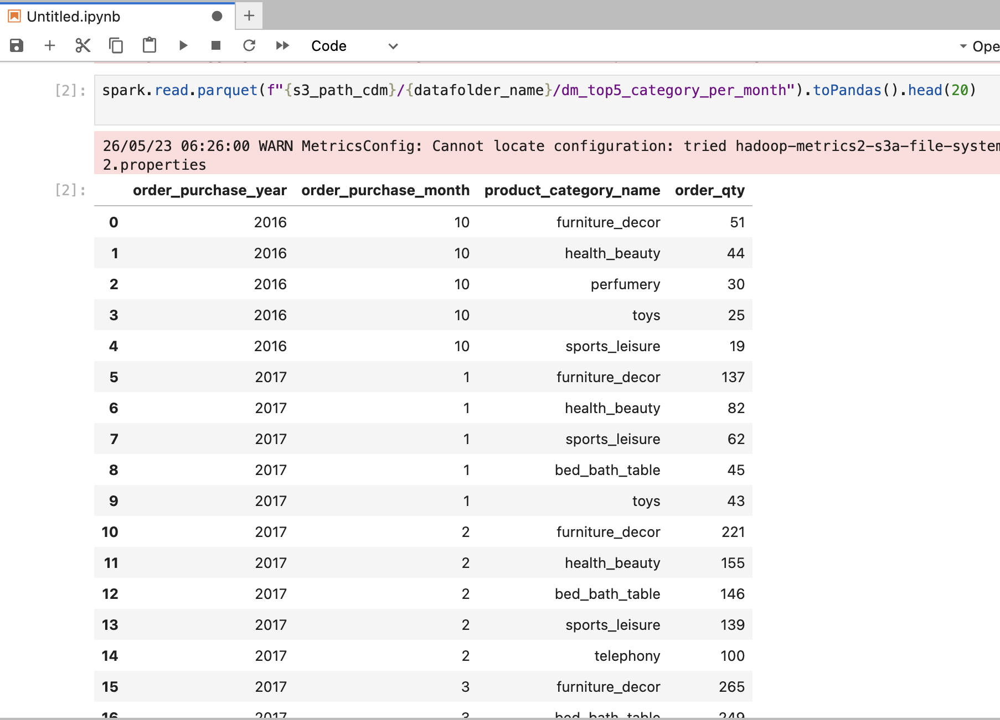

# Краткое содержание проекта

ETL-пайплайн данных для Ecommerce.
Исходные данные были взяты из Kaggle.
Пайплайн поочередно обрабатывает данные и складывает в 3 слоя (Staging,ODS,CDM), находящиеся в S3

## Стек:
* Хранение данные - S3 (MinIO)
* Обработка данных - PySpark
* Оркестрация данных - Airflow
* Тестирование и валидация кода - Jupyter Notebook

# Результат
В конечном итоге получаем 2 датамарта для бизнеса:
* dm_count_status_orders - подсчитывает какое распределение статусов по всем заказам на день
* dm_top5_category_per_month - подсчитывает топ-5 product category, которые больше всего пользуются популярностью у пользователей (больше всего заказов)

# Структура папок
**spark-jobs** хранит джобы, которые собирают витрины данных
**dags** содержит процессы оркестрации airflow

# Скриншоты проекта

# Контакты
tg - whoisortem

